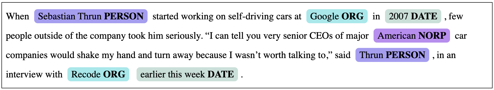
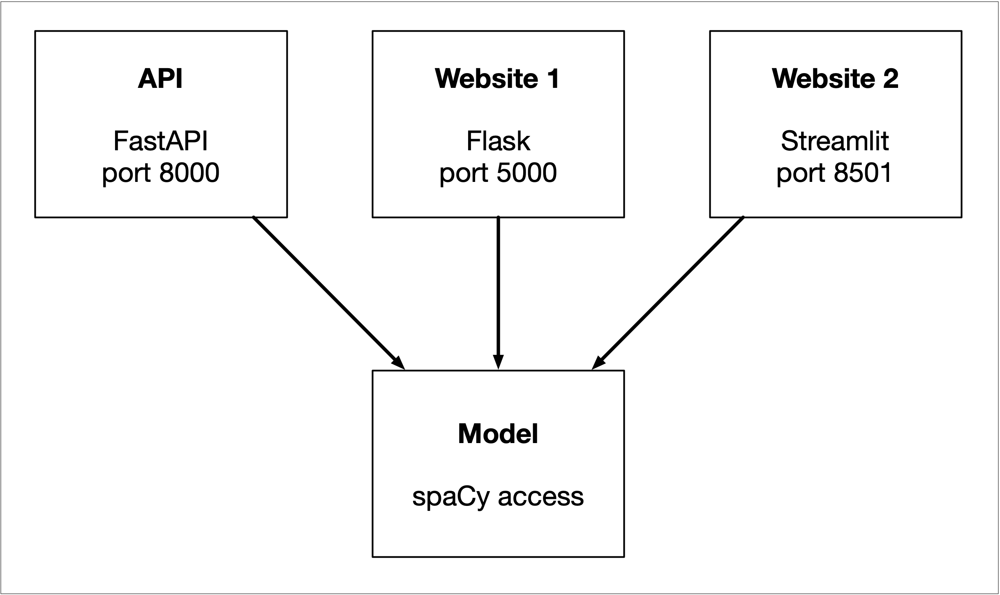

# Assignment 1 - Web Services

There are three parts to this assignment:

1. Create a RESTful API to access spaCy NER
2. Create a Flask webserver to access spacy NER
3. Create a Streamlit application to access spacy


### RESTful API with FastAPI

The API needs to respond to both a GET and a POST request at the same URL:

```bash
$ curl http://127.0.0.1:8000
$ curl http://127.0.0.1:8000 -H "Content-Type: application/json" -d@input.txt
```

The GET request should return something informative about the service and the post request should return the result of processing, basically a list of entities with the start and end offset, the label and the text. In both cases what comes back should be JSON.

Your API should also accept a pretty parameter:

```bash
$ curl http://127.0.0.1:8000?pretty=true
$ curl http://127.0.0.1:8000?pretty=true -H "Content-Type: application/json" -d@input.json
```


### Flask webserver

Create a Flask webserver that provides two pages: one that presents a form that you can use to send a request to spaCy and one that shows the result.

All the user should have to do to access the website is to point a browser at [http://127.0.0.1:5000](http://127.0.0.1:5000). After you send a request you should see something like this:



If you want you can use the stylesheet in [main.css](main.css), which was adapted from the styles that spaCy uses for its displaCy visualization.


### Streamlit

Create a small Streamlit application that you can access at [http://localhost:8501/](http://localhost:8501/). It should show the result of spaCy processing in any way you see fit, but you should use at least two ways of visualizing the result, for example, you could show a simple table of all named entities and a bar chart of word frequencies.

The main goal here is to play around with Streamlit a bit.


### Code design

You want to make sure that the main parts of code are clearly separated.



You need to organize your code so that the API and websites are independent and only depend on the model. And the model should not have any knowledge of the three interfaces. 


### Wat to hand in?

You should hand in a link to a Git repository. That repository will be also used for future assignments. There should be a top-level directory `assignment1` which should have a `README.md` file that explains exactly what to do to run your code. This should include:

- The required Python version. Just list what you ran it on, no need to test on other versions of Python. I hope you are all at least on Python 3.8.
- What modules need to be installed.
- How to start the RESTFull API, the Flask webserver and the Streamlit application.
- How use the API or what URL to load.


### How will this be graded?

Pretty leniently. It should run of course and it should be easy to use. Clear understandable code is a definitely a plus.


