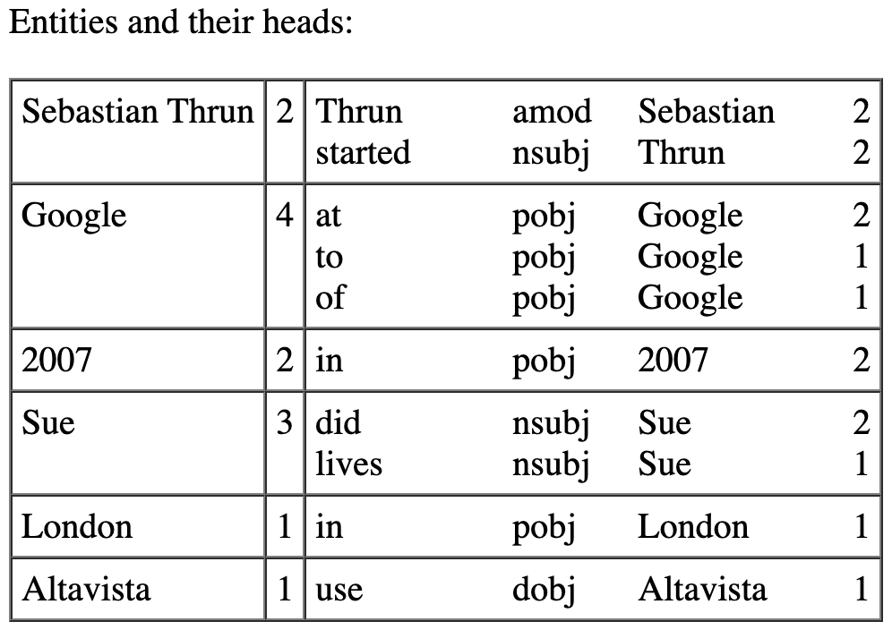

# Assignment 2 - Flask SQLAlchemy

This assignment starts off with the results of your previous assignment, in partuclar the Flask component. You can use that as your starting point, but you can also use the example solution that I will hand out.

To recapitulate, what you did for the Flask site in assignment 1 is to give web access to spaCy named entity and dependency processing.

In this assignment you have to hook up your previous code with a database backend. You need to store entities extracted and the relation they occur in. You have some leeway in what relations exactly you would be storing, here is a screenshot of the site I created, which shows just the entities with their heads:

> 

There should be three parts to your site:

- A page to enter text to be processed.
- A page to show the immediate results of processing, like what you had before. But processing now also means storing the results in the database.
- A page to show the content of the database, the screenshot above is from that page.

### Wat to hand in?

You should hand in a link to the same Git repository as you used for assignment 1. There should be a top-level directory `assignment2` which should have a `README.md` file that explains exactly what to do to run your code. This should include:

- The required Python version. Just list what you ran it on, no need to test on other versions of Python. I hope you are all at least on Python 3.8.
- What modules need to be installed.
- How to start the Flask webserver.

Make the `assignment2` directory self-contained, that is, everything needed to run your code should be in there, if you reuse code from `assignment1` than it should be copied over.

You should use Flask SQLAlchemy to access an SQLite database, which means that you will be working with an Object Relational Mapper.

### How will this be graded?

Pretty leniently. It should run of course and it should be easy to use. Clear understandable code is a definitely a plus.

Due date is March 12th, any time on earth.

