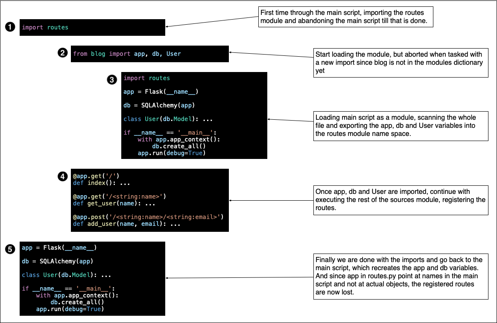

# The anatomy of a bad circular dependency

This documents explains how circular imports can go wrong, focusing on a Flask application.


## The starting point

We start with the simple blog example with just a single table in [../blog1.py](../blog1.py), repeated here with many details left out:

```python
from flask import Flask
from flask_sqlalchemy import SQLAlchemy

app = Flask(__name__)
db = SQLAlchemy(app)

class User(db.Model): ...

@app.get('/')
def index(): ...

@app.get('/<string:name>')
def get_user(name): ...

@app.post('/<string:name>/<string:email>')
def add_user(name, email): ...

if __name__ == '__main__':
    with app.app_context():
        db.create_all()
    app.run(debug=True)
```


## Separating out the routes

We aim to separate out the routes and the database logic for clarity, and we start with taking out the routes and adding an extra import:

```python
from flask import Flask
from flask_sqlalchemy import SQLAlchemy
import routes

app = Flask(__name__)
db = SQLAlchemy(app)

class User(db.Model): ...

if __name__ == '__main__':
    with app.app_context():
        db.create_all()
    app.run(debug=True)
```

And here is the routes module, which needs to import a couple of things from the main script:

```python
from blog import app, db, User

@app.get('/')
def index(): ...

@app.get('/<string:name>')
def get_user(name): ...

@app.post('/<string:name>/<string:email>')
def add_user(name, email): ...
```

The full versions of these files are in [blog.py](blog.py) and [routes.py](routes.py).

Note the circular import, which clearly is needed because the main script needs to import the routes and the routes need access to the `app`, `db` and `User` variables.


## The problem

When you start this application all actually seems well at first (not all terminal output is printed below):

```shell
$ python blog.py
```
```
 * Serving Flask app 'blog'
 * Debug mode: on
 * Running on http://127.0.0.1:5000
```

But when you try to ping the API with a GET request you will notice that the resource does not exist:

```
$ curl http://127.0.0.1:5000
```
```xml
<!doctype html>
<html lang=en>
<title>404 Not Found</title>
<h1>Not Found</h1>
<p>The requested URL was not found on the server. If you entered the URL manually please check your spelling and try again.</p>
```

To see what's happening take a look at this picture, which shows the execution flow:


Details:

- Step 1. Python starts executing the main script and immediately gets the request to import the routes module. Since routes is not loaded as a module yet in the sys.modules dictionary, Python adds it to sys.modules with an empty module object and continues to load module contents from `routes.py`.
- Step 2. Python starts executing the routes module and immediately needs to import the app variable from the main blog script, which was not defined as a module so Python goes off loading `blog.py`.
- Step 3. Python starts at the top and ignores the routes import because "routes" is already in sys.modules. It continues through the rest of the main script setting the app and db variables. The body of the main clause will not be executed because the name of the module is now not "\__main__" but "blog" because it was called as a module.
- Step 4. At the end of step 3 control goes back to executing the routes module, starting off immediately after the import. All routes are defined and registered with the app via the decorators, and all routes are associated with the functions. Note that the functions are never called directly and that the import here was done for the side-effect of beefing up the app.
- Step 5. Finally control goes back to the main script and we now execute the part of the file after the import. And this is where the problem occurs because we now create a new Flask application and the associations with the routes are now gone. However, the route is not used yet so there is no error and Python happily continues through the script (where the name is now set to "\__main__") and starts the application, albeit with an app without routes.

Here is another way of showing this:



