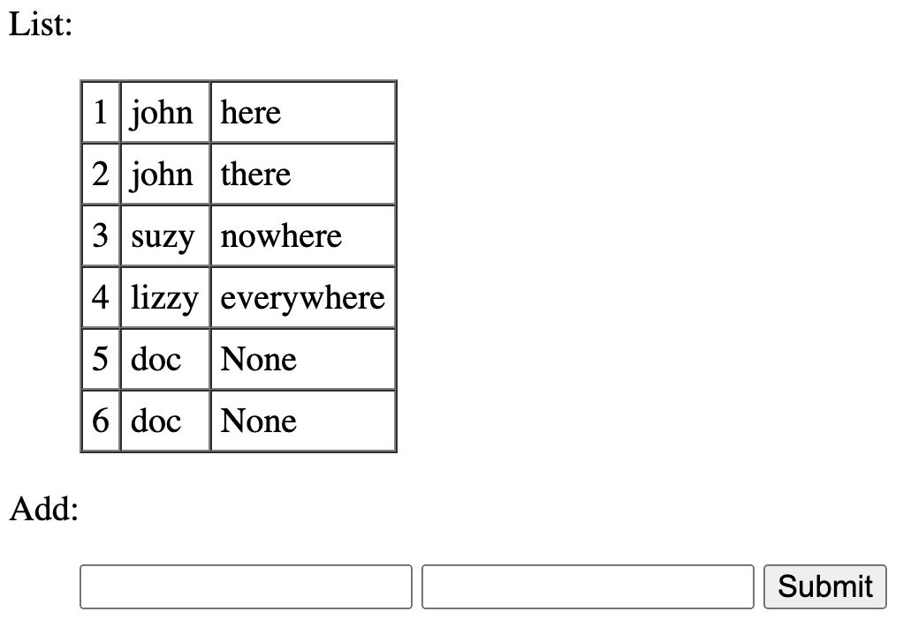

# SQLite Exercises

Some simple SQLite, Python-SQLite and Flask-SQLite exercises.


## Plain SQLite

For help see the [mini SQLite manual](../../../databases/sqlite/people/sqlite-mini-manual.md) for examples and the [SQlite site](https://sqlite.org/lang.html) for the full syntax.

Done from the sqlite or linux prompt. We will (1) create a very simple table from the sqlite prompt, (2) run some inserts, (3) load extra data from an external file, and (4) load data from the Linux prompt.

Create a table with the following fields:

- identifier: a unique integer and the primary key of the table
- name: name of a person, required
- address: address of a person, optional

Insert a couple of records, experiment with what it accepts.

Load extra data from the SQLite prompt:

- Create an SQL file and a CSV file with more records.
- Use built-in commands to load the files (type `.help` for a list of commands).

Load data from the Linux prompt.

- This needs to be an SQL file, you can use the one from above.
- Hint: you need to pipe the contents of the file into the sqlite command.


## Embedded SQL - Plain Python

Now we will do something similar from Python using the sqlite3 module, re-using the database from above.

For a quick tutorial/reminder on this module see [https://docs.python.org/3/library/sqlite3.html#tutorial](https://docs.python.org/3/library/sqlite3.html#tutorial).

Write a Python script that:

- opens a connection to the database
- creates a cursor and adds a few more records

Write another Python script that:

- opens a connection
- creates a cursor and displays all database rows

Run the two scripts and see if they do what you expect.

Question: do you see a security hole in what you did?<br/>
Answer: probably not, but things change when you allow user input.

## Embedded SQL - Flask

Building off the two earlier Python scripts, create a one-page Flask site that displays a list of records and a form to enter a name and address.



Mind the threading issue. If you open the connection as per usual you get a warning like this:

```
sqlite3.ProgrammingError: SQLite objects created in a thread can only be used
in that same thread. The object was created in thread id 4454245888 and this
is thread id 123145493499904.
```

This is because by default SQLite looks for the database in the same thread, but when you embed this in a Flask application then you access the databse from another thread, which is verboten. All you need to change is how to open the databse:

```python
connection = sqlite3.connect('db-names.sqlite', check_same_thread=False)
```

Also see:

- [https://sqlite.org/threadsafe.html](https://sqlite.org/threadsafe.html)
- [https://sqlpey.com/python/solved-how-to-handle-sqlite-threading-issues-in-flask/](https://sqlpey.com/python/solved-how-to-handle-sqlite-threading-issues-in-flask/)

You may take the template I used if that's helpful:

```html
<html>
  <body>
  <p>List:</p>
  <blockquote>
    <table cellspacing="0" cellpadding="5" border="1">
    
    <tr>
      <td>{{ row[0] }}</td>
      <td>{{ row[1] }}</td>
      <td>{{ row[2] }}</td>
    
    </tr>
    </table>
  </blockquote>
  <p>Add:</p>
  <blockquote>
    <form action="/" method="post">
      <input type="text" name="name" required />
        <input type="text" name="address" />
        <input type="submit" value="Submit">
      </form>
  </blockquote>
  </body>
</html>
```