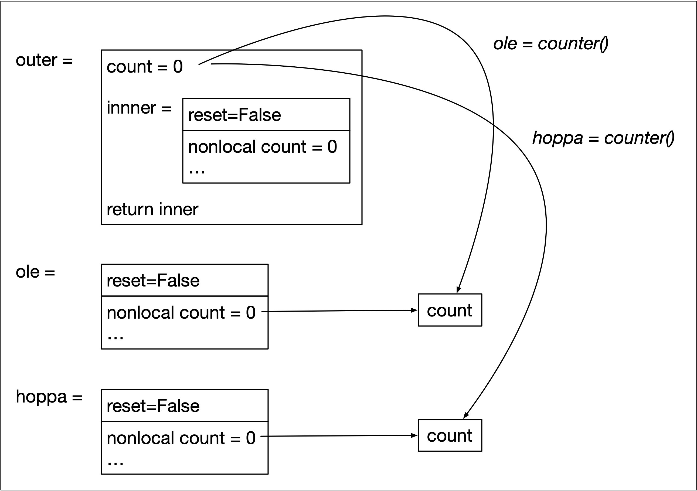

# Closures

The closure example in [closure.py](closure.py) has at its core the following code:

```python
def outer():
	count = 0
	def inner(reset=False):
		nonlocal count
		if reset:
			count = 0
		count += 1
		print(f'count={count}')
	return inner
```

The idea is that when you call the outer function it returns the inner function which has its own copy of the count variable, and that variable is closed of from the rest of the world and is only accesable via the new function, moreover, that variable keeps is own state and is not reset each time the inner function is called.

```python
>>> ole = outer()
>>> hoppa = outer()
>>> ole()
1
>>> ole() 
2
>>> hoppa()
1
```


