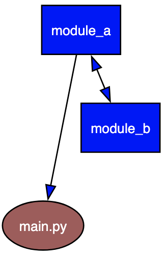

# Python circular imports

A circular dependency occurs when two or more modules depend on each other. In general, circular dependencies indicate suboptimal design, usually a reshuffling of the modules fixes the problem and makes the code less tightly couple and easier to maintain.

But sometimes circular references are needed, for example when creating a Flask application, so it is a good idea to understand them better. This document shows two examples of cirecular dependencies, one that breaks the code and one that actually works, even though it does not present a good use case.

Let's assume three files (`main.py`, `module_a.py` and `module_b.py`), where the main script imports one of the modules and the two modules import each other:



For a more involved example of a failed circular import, see the [Flask example](../../databases/alchemy/circular/README.md) in the database section. That example also shows visually how the execution flow progresses and where it all goes wrong.


## A circular import that fails

Here is a circular import that fails, where the two modules both try to import a specific variable:

```python
# main.py
import module_a
```

```python
# module_a.py
from module_b import b
def a():
	print('a')
```

```python
# module_b.py
from module_a import a
def b():
	print('b')
```

Note that `main.py` doesn't do anything beyond importing `module_a`, but when you run it you get into trouble:

```
$ python main.py
Traceback (most recent call last):
  File "/Users/marc/.../python-examples/imports/example1/main.py", line 2, in <module>
    import module_a
  File "/Users/marc/.../python-examples/imports/example1/module_a.py", line 2, in <module>
    from module_b import b
  File "/Users/marc/.../python-examples/imports/example1/module_b.py", line 2, in <module>
    from module_a import a
ImportError: cannot import name 'a' from partially initialized module 'module_a' (most likely due to a circular import) (/Users/marc/.../python-examples/imports/example1/module_a.py)
```

In fact, Python never gets to defining the functions. It reads the import line `main.py`, goes on to the import line in `module_a`, then goes to `module_b` where it finds another import, after which it dutyfully goes back to `module_a`, but that one was already imported, but only partially so the name to be imported is not available.

Note that when Python imports a module, it checks the module registry to see if the module was already imported. If it was then Python uses that module from the registry, which is a Python dictionary of initialized modules that have been indexed by name. This dictionary is stored in sys.modules.


## And one that works

What will work is the following, where we change the mutual imports performed by the modules (the main script remains unchanged):

```python
# module_a.py
import module_b
def a():
	print('a')
```

```python
# module_b.py
from module_a import a
def b():
	print('b')
```

What happens here is that just importing the module work fine, even though there is nothing in there. But after Python successfully imported `module_a` from `module_b` it continues to the definition of function `a`, which concludes the import of `module_b` from `module_a`, after which Python reads the definition of function `a`, which concludes the import of `module_a` from the main scipt. And at that point the entire module contents are fleshed out.

So when the flow of control goes back to the main script all importing has been done and all variables in the two modules were instantiate, so now the main scipt could actually do something with the content of the modules:

```python
import module_a
module_a.a()
module_a.module_b.b()
module_a.module_b.module_a.a()
``` 

```
$ python main.py
a
b
a
```
