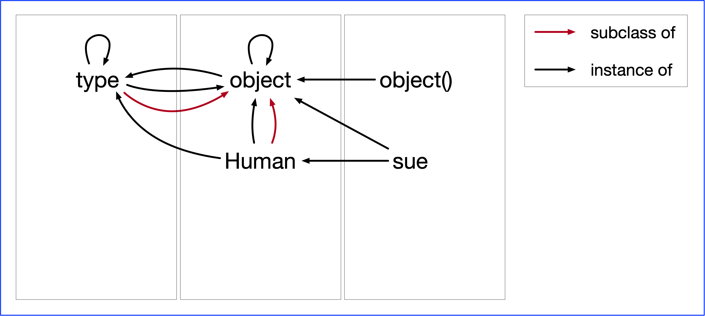
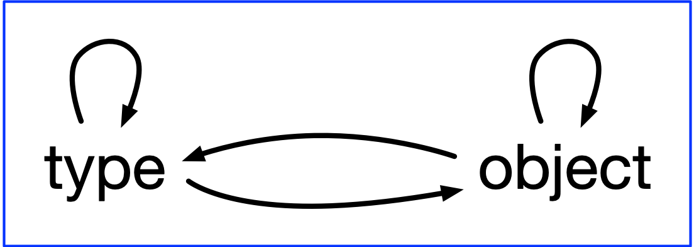

# Creating classes revisited

The class creation picture in [p1-instances.md](p1-instances.md) is not complete since we are leaving out the *type* class, which is instrumental in creating new classes.

The code in the previous section that was used to create the *Human* class was actually using a couple of defaults. One was that *object* was used as the base class. Less well known is that there is a special class that is used to create classes, class like that are called metaclasses and the default metaclass in Python is *type*.

Let's define the *Human* class again, but now with defaults explicitly stated.

```python
class Human(object, metaclass=type):
    def __init__(self, name):
        self.name = name
```

And now let's draw another picture of relations between classes an dinstances, with the *type* class added.



First observe the relation between *type* and *object*. The *type* class is a subclass of *object*. It is also an instance of *object* because everything is. But object is also an instance of *type* since *type* is used to created *object*, and that is pretty much true for any other class created as a direct or indirect subclass of *object*.

There definitely is some weirdness in the relation between *type* and *object*:



When you dig into this deeper you will notice people mention that those two classes cannot be defined within Python and must be connsidered part of the Python magic that happens behind the screens. The two objects are interdependent and they cannot stand on their own since they are defined in terms of each other. Not shown in the picture is that the type of type is equal to type, that is, the following is true:

```python
>>> type(type) is type
```

Here is a quote from a post on [stackoverflow](https://stackoverflow.com/questions/55775218/why-is-object-an-instance-of-type-and-type-an-instance-of-object), which was
attributed to Luciano Ramalho:

> The classes object and type have a unique relationship: object is an instance of type, and type is a subclass of object. This relationship is "magic": it cannot be expressed in Python because either class would have to exist before the other could be defined. The fact that type is an instance of itself is also magical.

Now, going back to the bigger picture, look at the *Human* class, which as we already knew is both an instance and subclass of *object*. In addition it is also an instance of *type* because *Human* was created as an instance of *type*.


### The role of type in class creation

Understanding how *type* is used when creating a new class helps understanding metaclasses in general. Suppose you have some class definition as the one below.

```python
class NewClass(BaseClass):
    ham = 'ham'
    def spam(self, n):
         return 'spam' * n
```

WIth that code, Python essentially does this:

```python
def spam(self, n):
    return 'ham' * n

NewClass = type('NewClass', (BaseClass,), {'ham': 'ham', 'spam': spam})
```

So `type` is used to create the class and it is given the name of the class, a tuple of base classes, and a dictionary. The dictionary is made from the block under the class statement, which is seen as a namespace with names refering to objects (a string and a function in this case).
