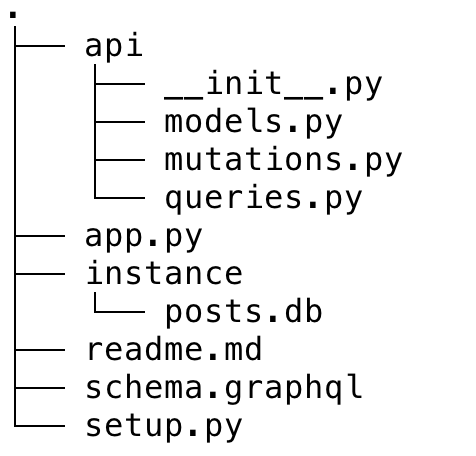
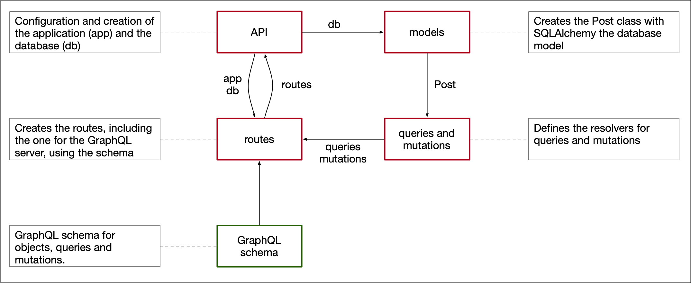
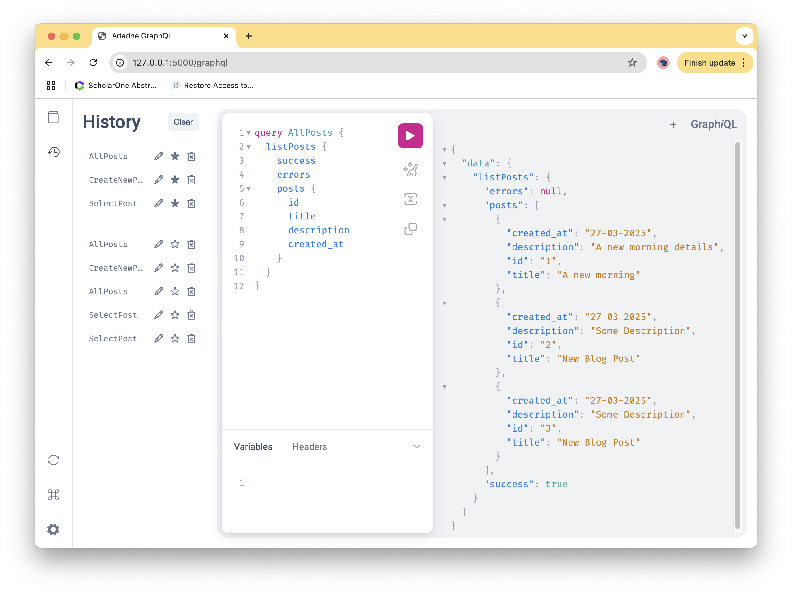

# GraphQL Example

This example is mostly based on [https://www.apollographql.com/blog/complete-api-guide/](https://www.apollographql.com/blog/complete-api-guide/), which is a Python-centric tutorial and includes a link to the [source code on GitHub](https://github.com/Shadid12/flask-graphql).

It is from 2021 and seems out of date given the following issues:

- Use of ElephantSQL which was taken off-line.
- A problem with circular references
- Use of CORS (Cross Origin Resource Sharing), which was possibly used for ElephantSQL.
- Use of a deprecated way to generate a GraphQL playground.

It did help me build and use my first GraphQL Server with Flask though.


## Preliminaries

I used Python 3.11.6 and installed Flask, Flask SQLAlchemy and the Ariadne library for GraphQL-Python integration:

```bash
pip install flask ariadne flask-sqlalchemy
```

First create and populate the database:

```bash
python setup.py
```
The basic structure of the application is as follows:



This uses an api package where the initialization file defines the configuration settings, the Flask application and the SQLAlchemy database, and then loads the routes. The core of the GraphQL application is in the routes module, which loads the resolvers for the queries and mutations. The resolvers use the database module. Finally, the type schema are in `schema.graphql` and the run script loads the api package and starts everything off.


## Explaining the code

Let's now explain the code bit by bit. This explanation assumes that you are good with your Flask and SQLAlchemy basics. As an initial overview, here is an image that shows the relations between the main components:



Python imports are denoted by arrows, code modules have dark red borders and schema have dark green borders.

### Defining the database model

This is simple, the [api/models.py](api/models.py) module contains a simple and generic definition of a model:

```python
class Post(db.Model):
    id = db.Column(db.Integer, primary_key=True)
    title = db.Column(db.String)
    description = db.Column(db.String)
    created_at = db.Column(db.Date)
```

The *db* variable was generated in the API's initialization file and contains a Flask-aware SQLAlchemy instance. The Post class also has a method to create a dictionary from a Post.


### The package's initialization file

Also simple, [api/\_\_init\_\_.py](api/__init__.py) just contains some familiar settings and imports the routes module, which refers to the GraphQL endpoint. 

```python
app = Flask(__name__)
app.config["SQLALCHEMY_DATABASE_URI"] = "sqlite:///posts.db"
app.config["SQLALCHEMY_TRACK_MODIFICATIONS"] = False
db = SQLAlchemy(app)

from api import routes
```


### The GraphQL schema

GrapQL schema are written in the schema definition language (SDL, see
[https://graphql.org/learn/schema/](https://graphql.org/learn/schema/)). Some GraphQL libraries let you construct schema types, fields, and resolver functions together using the same programming language that was used to write the GraphQL implementation, but here we use SDL.

The schema definitions are in [schema.graphql](schema.graphql). This first one for "schema" determines what type of operations clients can perform. In this case, clients can perform Query operations and Mutation operations. The names are not fixed to be "Query" and "Mutation" (but if you change them you also need to change tham in the application).

```
schema {
    query: Query
    mutation: Mutation
}
```

Next we have some data types. The Post type's structure is identical to the Post model defined for the database.  The name does not have to be the same as the class name of the model, but it sure make sense to do that. The PostsResult type defines the structure of the response object when we query for all the posts in the database and PostResult represents the response when we query for one post in the database. The exclamation mark indicates a required value, lists (square brackets) are lists of certain types and can be empty.


```
type Post {
    id: ID!
    title: String!
    description: String!
    created_at: String!
}

type PostResult {
    success: Boolean!
    errors: [String]
    post: Post
}

type PostsResult {
    success: Boolean!
    errors: [String]
    posts: [Post]
}
```

The type Query defines the query operations that our clients can perform. Here, we have two queries: a listPosts query to grab all the posts from the database and a getPost query to get a particular post by its id. And the type Mutation defines three operations: createPost, updatePost and deletePost. All these aperations will be accessed bu the application.

```
type Query {
    listPosts: PostsResult!
    getPost(id: ID!): PostResult!
}

type Mutation {
    createPost(title: String!, description: String!, created_at: String): PostResult!
    updatePost(id: ID!, title: String, description: String): PostResult!
    deletePost(id: ID): PostResult!
}
```

### The query resolvers

Some background on resolvers:

- [https://www.tutorialspoint.com/graphql/graphql_resolver.htm](https://www.tutorialspoint.com/graphql/graphql_resolver.htm)
- [https://graphql.org/learn/execution/](https://graphql.org/learn/execution/)

A resolver is a collection of functions that generate the response for a GraphQL query. In simple terms, a resolver acts as a GraphQL query handler. In our case we have one resolver per query and there are two query resolvers. This is the resolver for the "listPosts" query from the SDL above.

```python
def listPosts_resolver(obj, info):
    try:
        posts = [post.to_dict() for post in Post.query.all()]
        return {"success": True, "posts": posts}
    except Exception as error:
        return {"success": False,"errors": [str(error)]}
```

The resolver is really a bridge between the schema and the return value. This one uses the Post model to get the results from the database and then wraps it in exactly the way that the schema expect, if you leave out "success" for example you will get an error. Note the "obj" and "info" arguments, these are always handed in to the resolver and they contain the object with the result returned from the resolver on the parent field and information about the execution state of the query, including the field name and path to the field from the root. These are not used here.

> Add something about the args and context arguments

The other resolver is for selecting a post:

```python
@convert_kwargs_to_snake_case
def getPost_resolver(obj, info, id):
    try:
        post = Post.query.get(id)
        return {"success": True, "post": post.to_dict()}
    except AttributeError:
        return {"success": False, "errors": [f"Post matching id {id} not found"]}
```

There are two differences here. One is the added argument, which is licensed by the "getPost" definition in the schema and needs to have the exact same name here. The other is the decorator, which in this case is not needed but which would map camelCased argument names into snake-cased argument names.

> TODO: come up with a use case for this 


### The mutation resolvers

In a way this is more of the same with the main difference with the query resolvers being that we actually commit changes to the database. We look at one of the three resolvers here.

```python
@convert_kwargs_to_snake_case
def create_post_resolver(obj, info, title, description):
    try:
        today = date.today()
        post = Post(title=title, description=description, created_at=today)
        db.session.add(post)
        db.session.commit()
        return { "success": True, "post": post.to_dict() }
    except Exception as e:
        return { "success": False, "errors": [f"{type(e)}: {e}"] }
```

The idea is the same as with the query resolvers. The "title" and "description" arguments are licensed by the schema, these arguments are used to create a new post and update the database and then a response is generated that matches the specifications in the schema.

> I tried bundeling all of these in with the query resolvers by getting rid of the Mutation type and extending the query type. That did not work. There is in general a distinction beween queries and mutations, but I cannot see what it is in the example code.


### The routes module

This is where everything is tied together. The file [api/routes.py](api/routes.py) highlights the use of Ariadne, a Python library for implementing GraphQL servers ([https://pypi.org/project/ariadne/](https://pypi.org/project/ariadne/)). In the first part of the file we create Query and Mutation objects, add fields to them and associate the field with resolvers:


```python
query = ObjectType("Query")
mutation = ObjectType("Mutation")

query.set_field("listPosts", queries.listPosts_resolver)
query.set_field("getPost", queries.getPost_resolver)

mutation.set_field("createPost", mutations.create_post_resolver)
mutation.set_field("updatePost", mutations.update_post_resolver)
mutation.set_field("deletePost", mutations.delete_post_resolver)
```

Ariadne ObjectTypes are created for the Query and Mutation types from the schema and each field from the schema is instantiated as a field on the object and linked to its resolver.

Next we load the schema using the following boilerplate.

```python
type_defs = load_schema_from_path("schema.graphql")
schema = make_executable_schema(
    type_defs, query, mutation, snake_case_fallback_resolvers)
```

Now we can set up the endpoint. Unlike with your typical REST application there is only one endpoint for which we define a GET and the POST method. For the GET, which is technically not required, we typically use a standard explorer that allows you to query the GraphQL server:

```python
explorer_html = ExplorerGraphiQL().html(None)

@app.get("/graphql")
def graphql_playground():
    return explorer_html, 200
```

Examples for this will be shown below.

The server itself is sitting at the endpoint listening to POST requests:

```python
@app.post("/graphql")
def graphql_server():
    data = request.get_json()
    success, result = graphql_sync(
        schema,
        data,
        context_value=request,
        debug=app.debug)
    status_code = 200 if success else 400
    return jsonify(result), status_code
```

This is the actual GraphQL server. It starts by using the Flask request to get the data and then hands it to the GraphQL function that executes a query against the schema. Normally you would use "graphql" to execute the query asynchronously, but you cannot do that with Flask.

Finally, it should be noted that the routes mnodule also includes a standard GET resources to the site's root, all it does is expose a link to the GraphQL playground.


## Accessing the server

First start the server with

```bash
python run.py
```

You can now access the server in several ways, here we describe (1) using the explorer and (2) using cURL on the command line.


###  GraphiQL

The explorer runs on [http://127.0.0.1:5000/graphql](http://127.0.0.1:5000/graphql):



### GQL

One of the libraries you can use to create a Python client.

```bash
pip install gql[all]
```

```python
import json

from gql import gql, Client
from gql.transport.aiohttp import AIOHTTPTransport


# Select your transport with a defined url endpoint
transport = AIOHTTPTransport(url="http://127.0.0.1:5000/graphql")

# Create a GraphQL client using the defined transport
client = Client(transport=transport, fetch_schema_from_transport=True)

# Provide a simple GraphQL query, just listing the titles
query = gql('query AllPosts { listPosts { posts { title } } }')

# Execute the query on the transport
result = client.execute(query)
print(json.dumps(result))
```


```json
{
  "listPosts": {
    "errors": null,
    "posts": [
      {
        "title": "A new morning"
      },
      {
        "title": "Another one"
      }
    ],
    "success": true
  }
}
```


### Command line access

To select a post use cURL as follows:

```bash
curl 127.0.0.1:5000/graphql -H 'content-type: application/json' -X POST -d '
{
  "query": "query SelectPost { getPost (id: 1) { post { title } } }"
}'
```

Which will return

```json
{
  "data": {
    "getPost": {
      "post": {
        "title": "A new morning"
      }
    }
  }
}
```

Alternatively create a file named "query-SelectPost.json" with this content

```json
{
  "query": "query SelectPost { getPost (id: 1) { post { title } } }"
}
```

And run

```bash
curl 127.0.0.1:5000/graphql -H 'content-type: application/json' -X POST -d@query-SelectPost.json
```

Which will have the same result as above.

This works for mutations as well, but with longer queries it gets a bit cumbersome so you are better off with doing this programatically.

```bash
curl 127.0.0.1:5000/graphql -H 'content-type: application/json' -X POST -d '
{ 
  "query": "mutation CreateNewPost { createPost( title: \"New Blog Post\", description: \"Some Description\") { post { id title description created_at } success errors } }"
}'
```