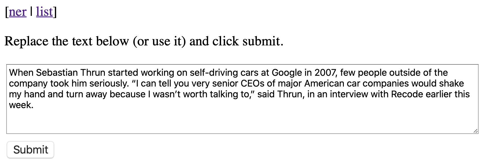
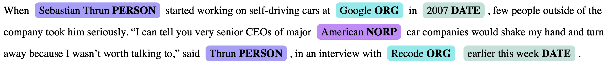
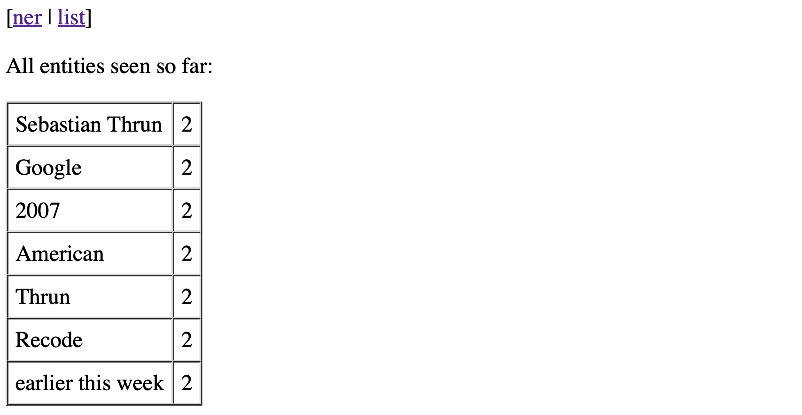

# Assignment 2 - Adding a Database and Dockerize

There are two parts to this assignment:

1. Add a database backend to your server that accesses spacy NER
2. Dockerize the application

## Database backend

You can do this using your previous code for the Flask web server or the example solution that I will have handed out, but if you want you can do this with Streamlit. The instructions below are focused on using a Flask server.

The Flask webserver should have three pages: one that presents a form that you can use to send a request to spaCy, one that shows the result, and one that list all results so far. The first page is a starter page that could look as follows.

The results page includes the results as before

The page with results so far is a simple table with counts for each entity ever found. For example, below is the list after you parsed the same standard example twice.

All the user should have to do to access the website is to point a browser at [http://127.0.0.1:5000](http://127.0.0.1:5000).

To access spaCy you can again use the code in `ner.py`. To get the entities out of the markkup string you should use Python library for XML parsing. One that is relatively easy to use is BeautifulSoup ([https://pypi.org/project/beautifulsoup4/](https://pypi.org/project/beautifulsoup4/).

## Dockerizing the application

Dockerize the above application by creating a Dockerfile that can be used to create a Docker image and then run a Docker container that contains the Flask server (or Streamlit application). Once the container is started a user should be able to access it using a URL as above ([http://127.0.0.1:5000](http://127.0.0.1:5000)) but you can choose to use a different port.

Some of this will already be done in class and all other bits and pieces you need for this you will have after the two lectures on Docker.

## Due date and what to hand in

This is due March 28th.

You should hand in a link to a Git repository, and that should be the same repository that you used for the first assignment. There should be a top-level directory `assignment2` which should have a `README.md` file that explains exactly what to do to run your code. This should include:

- The required Python version. Just list what you ran it on, no need to test on other versions of Python. I hope you are all at least on Python 3.8.
- What modules need to be installed.
- How to start the Flask webserver or the Streamlit application.
- How build the Docker image and how to run the Docker container.

Obviously, there should also be a `Dockerfile` in the `assignment2` directory.

## Grading

Pretty leniently. It should run of course and it should be easy to use. Clear understandable code is a definitely a plus.
