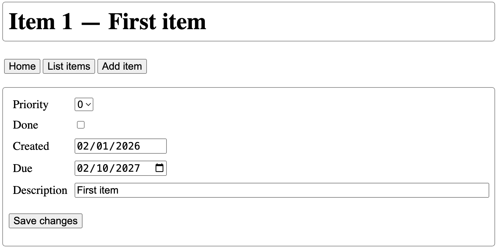

# Assignment 1b - Flask

Assignment 1 is about creating three different kinds of web-based interfaces: FastAPI, Flask and Streamlit. This is the second part of assignment 1, focusing on Flask.

Due date: February 10th, any time on earth.

This assignment assumes you have done [assignment 1a](assignment1a.md), at least the TODO list part. You may make changes to the TODO list implementation, but make sure that they do not break your FastAPI implementation from Assignment 1a. In case you used my example code, be warned that while doing this Flask assignment I found some errors in that code, so pull the latest version or look at the [changes](https://github.com/marcverhagen/cs217b/commit/ca1822e68e98c45c5c154c892436b1a2ceea0cab) on GitHub.

Your mission is to create a website that accesses the TODO list application.

## The Website

You need to write a Flask site that gives access access to the todo application without the need to use an API. That is, this is to be used by non-technical people.

Your website needs to provide at least the following functionality:

- Viewing a list of todo items.
- Adding an item.
- Changing an item.

Here is a screen shot of the item page, where you can make changes to the item:

</td></tr>

You should be allowed to change the due date, the priority and the description, and you should also be able to check a box to indicate that the item is done. You should not be able to change the identifier and the creation date.

To see this at work see [https://marcverhagen.pythonanywhere.com/](https://marcverhagen.pythonanywhere.com/). You should all be able to add and change items. This could be interesting, a life demo of a site that was only tested informally by me, what could possibly go wrong?

In my implementation I ended up with resources for the following: splash page, items listing, listing of one item, page to add an item, and a page to deal with changes. You can carve this up differently, you could even have just one resource, but I would not advice that because it makes that page rather complex. I find it useful to think of this in terms of what you want a resource to do and what you want it to display.

You should use templates and a style file. And if you have multiple pages you should use template inheritance and template inclusion.

## What and how to submit?

Use the same GitHub repository as for assignment 1a. You submit by sending me an email pointing me to a URL that serves as an entry for me to your assignment. As before, I will at that point do a git-pull and I will look at the tip of the main branch.

That repository should contain the following:

- All the code needed to run your application.

- A README file that tells me exactly what I should do:
	- What modules to install.
	- How to start the Flask server.
	- What URL to start with.
	- This is to file that you point me at in your email.

You do not need to worry about error handling unless where noted otherwise. You also do not need to do any unit test, but I do expect that your code runs so you will at least need to do some informal testing.

The easier it is to understand your code the better.
