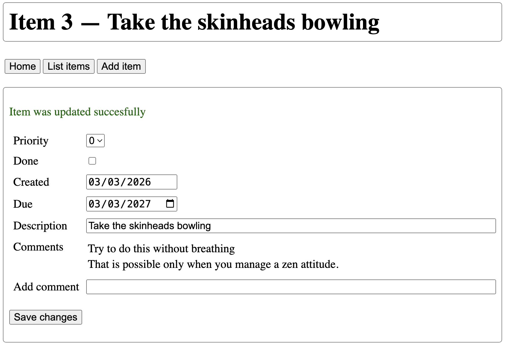

# Assignment 2 - Flask & SQLAlchemy

This assignment is about taking a Flask website and connecting it to a database backend.

Due date: March 17th, any time on earth.

This assignment assumes you have done [assignment 1b](assignment1b.md), and you can, but do not have to, re-use code from that or from the not-quite-yet-posted example answer for assignment 2. With assignment 1b there was a requirement that assignment 1a code should not break. For this one that requirement is relaxed, but for assignment 3 you will need to integrate all that you did before, so keep that in mind.

Your mission is to create a website that accesses the TODO list application, but instead of using a text file as the databse you should use SQLite and use Flask-SQLAlchemy as the interface to the SQLite database. There are two parts:

1. Extending the TODO list application so it also includes comments on TODO items.
2. Creating the Flask site.

## Amending the TODO list application

A TODO List item should allow addition of comments. On the TODO List side this should be a very minimal change so don't overthink it. A comment is just a string, it does not need to have a timestamp or other metadata. You also do not need to worry about deleting comments.

But apart from this minimal change there is a wider question here which is to what extend the nature of the TODO List application is going to change now that we choose to store it into a database. When you create an SQLAlchemy model you will realize that now the data is in the database much of the functionality that you had in the TODO application is now automatically transfered to the model and the code that accesses the database. If that is so, and it was for me, then just roll with it.

## The Website

This is like the website for assgnment 1b, but with some added functionality. In the site you should be able to do the following:

- Viewing a list of todo items.
- Adding an item.
- Viewing an item, now also including a list of comments.
- Changing an item, now also including the option to enter a new comment.

Here is a screen shot of the item page, where you can make changes to the item:

</td></tr>

You should be allowed to change the due date, the priority and the description, and you should also be able to check a box to indicate that the item is done. And you should be able to add a comment. You should not be able to change the identifier and the creation date.

<!--
To see this at work see [https://marcverhagen.pythonanywhere.com/](https://marcverhagen.pythonanywhere.com/). You should all be able to add and change items. This could be interesting, a life demo of a site that was only tested informally by me, what could possibly go wrong?
-->

In my implementation I ended up with the same resources as for assignment 1b: splash page, items listing, listing of one item, page to add an item, and a page to deal with changes. You can carve this up differently, you could even have just one resource, but I would not advice that because it makes that page rather complex. I find it useful to think of this in terms of what you want a resource to do and what you want it to display.

You should use templates and a style file. And if you have multiple pages you should use template inheritance and template inclusion.

## What and how to submit?

Use the same GitHub repository as for assignment 1a. You submit by sending me an email pointing me to a URL that serves as an entrypoint to your assignment. As before, I will at that point do a git-pull and I will look at the tip of the main branch.

That repository should contain the following:

- All the code needed to run your application.

- A README file that tells me exactly what I should do:
	- What modules to install.
	- How to start the Flask server.
	- What URL to start with.
	- This is the file that you point me at in your email.

You do not need to worry about error handling except where noted otherwise. You also do not need to do any unit test, but I do expect that your code runs so you will at least need to do some informal testing.

The easier it is to understand your code the better.
