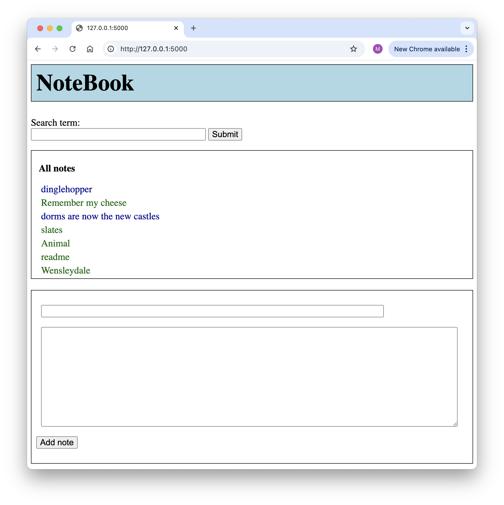
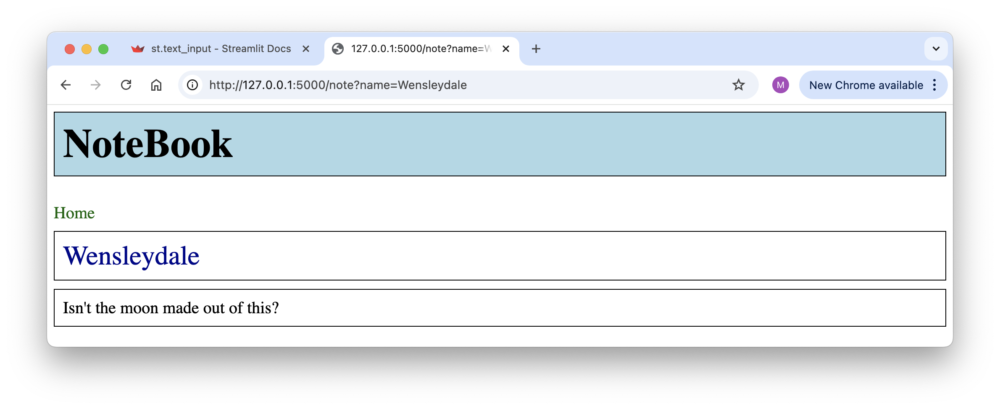
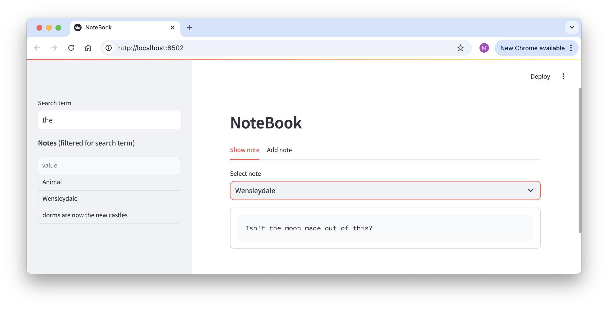

# Assignment 1

Create three different kind of web interfaces to a simple note taker application. This is not rocket science, but of the three assignments in this course this is probably going to be the most time-intensive, so you will get three weeks to do this.

Due date: February 25

This assignment has four parts:

1. simple note taking application
2. an API to the notes, using FastAPI 
3. a mini web site to browse and add notes, using Flask
4. a StreamLit app to access the notes


## The note taking application

This should be a standalone module that will be used by the FastAPI, Flask and Streamlit interfaces. You may do this any way you want, but at the minimum the application should be able to

- Create a note, where a note has a name and a content.
- Return a list of all notes.
- Return a list of notes that match a search term.
- Return the content of a note identified by name.

The notes do not have to be persistent, that is, when restarting the application it is okay if all your notes are gone. I could not emotionally deal with that so I wrote all notes to a directory.

Here are some examples of what my note taker code does:

```python
>>> from notes import NoteBook
>>> nb = NoteBook('data')
>>> nb['Remember my cheese'].text()
'I want both Gouda and Cheddar'
>>> len(nb.notes())
14
>>> nb.add('Wensleydale', "Isn't the moon made out of this?")
True
>>> len(nb.notes())
15
>>> nb.find('moon')
['Wensleydale']
```


## The API

A FastAPI script that at least has the following resources/endpoints:

```
http://127.0.0.1:8000/
http://127.0.0.1:8000/list
http://127.0.0.1:8000/find?term=moon
http://127.0.0.1:8000/note/Wensleydale
```

The first one should return a text string with hints to the user on how to access the API. The second returns a list with all note names and the third dictionary including all notes that match the search term. And the fourth retrieves the text from a specific note.

```shell
$ curl http://127.0.0.1:8000/find?term=moon
{"term":"moon","matching notes":[["Wensleydale"]]}
$ curl http://127.0.0.1:8000/note/Wensleydale
Isn't the moon made out of this?
```

The above are all GET requests. You also have the API respond to a POST request which allows adding a note either by handing in a dictionary or a file:

```
curl -X 'POST' \
  'http://127.0.0.1:8000/add' \
  -H 'accept: application/json' \
  -H 'Content-Type: application/json' \
  -d '{
  "name": "Remember my cheese",
  "content": "I want both Gouda and Cheddar"
}'
```

```
curl -X 'POST' \
  'http://127.0.0.1:8000/add' \
  -H 'accept: application/json' \
  -H 'Content-Type: application/json' \
  -d @note1.json
```

These should return some kind of note indicating success or failure.


## The mini website

This should be a website with two or three pages (the one I wrote has two). In my case, the main page shows a list of all notes, a box for a search term, and an option to add a note:



And the note with its content gets its own page:



You are free to make it look any way you want, but it should be easy to perform the main functions of the site:

- see all notes
- see the content of a note
- search for notes
- add a note

You should use templates and at least a very simplistic style sheet.


## The Streamlit application

As with the Flask site, you may make this look any way you want, as long as the four main functions listed previously are easily accessable. My application looks like this:




## What and how to submit?

You submit by sending me an email with a link to a GitHub repository. That repository should have a standard structure, an description of that structure is at [https://github.com/marcverhagen/cs217-assignments](https://github.com/marcverhagen/cs217-assignments).

Make sure we can run your script as follows:

```shell
# The API
uvicorn api:app --reload

# The Website
python app.py

# The streamlit application
streamlit run stream.py
```

In general, you do not need to worry about error handling unless where noted otherwise. You also do not need to do any unit test, but we do expect that your code runs so you will at least need to do some informal testing.

Try to make your code follow general Python coding standards (but never blindly follow standards), the easier it is to understand your code the better.
