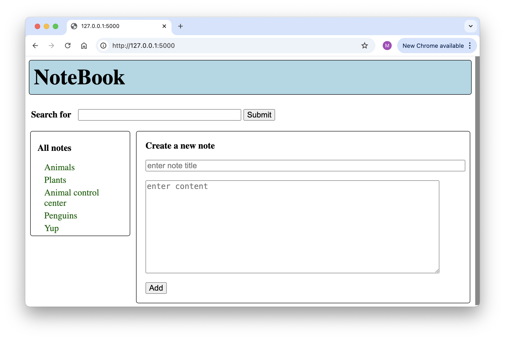
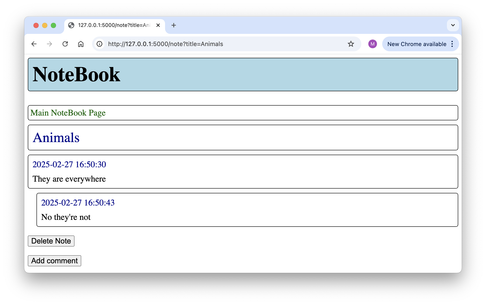
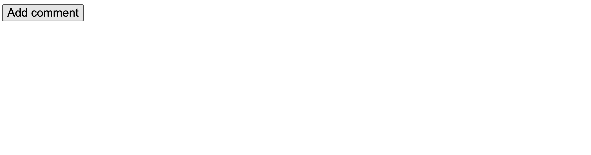
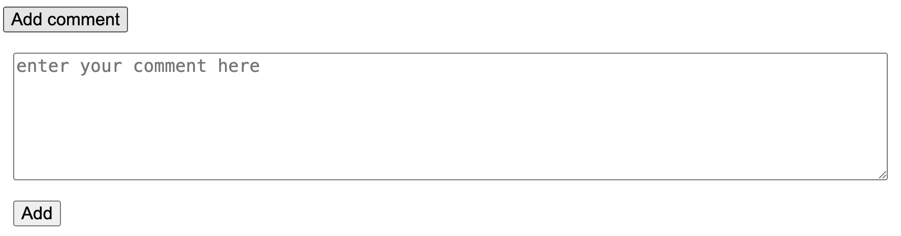
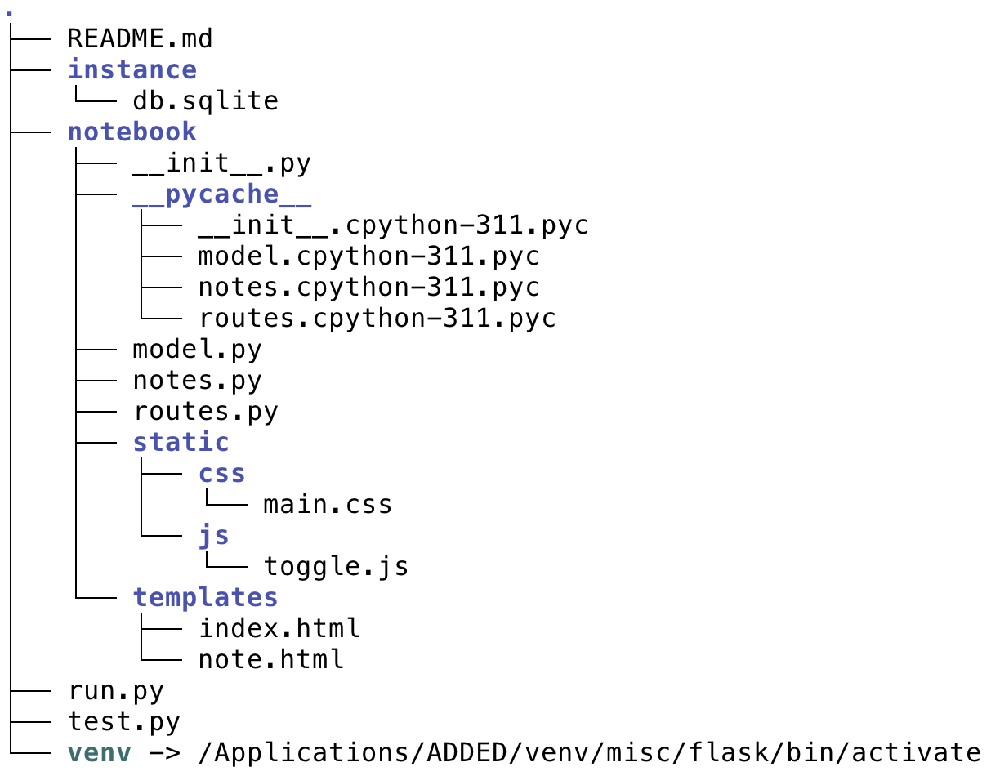

# Assignment 2

In assignment 1 you created a note-taking application and provided access to it via FastAPI, Flask and Streamlit. For this assignment you will continue to work on the note-taking application and its Flask web interface. The core of the assignment is to add a database backend using Flask-SQLAlchemy, but we also add some functionailty to the note-taker and the website. 


### New functionality for the note-taking application

For assignment 1, your note-taking application was able to do the following:

- Create a note, where a note has a name and a content.
- Return a list of all notes.
- Return a list of notes that match a search term.
- Return the content of a note identified by name.

That would be a tad too trivial so we expand the functionality a bit. You should add the following:

- Allow comments on a note.
- Add a date to each note and comment.
- Delete a note and all of its comments.


### New functionality for the web page

The Flask site in assignment 1 allowed you to (1) see a list of all notes, (2) see the content of a note, (3) search for notes, and (4) add a note. For this assignment you will still need to do that, but you should make sure that the following are also possible:

- When displaying a note you also get to see the comments.
- Searches should also search the comments.
- There must be a way to add a comment.
- There must be a way to delete a note with its comments.

Here are two screenshots of the pages that I created: the index page and the page for a note.



The index page shows a list of all notes, a search box to filter the list, and a widget to add a new note.



The page for a note has a link back to the main page, the note's title and its content (with a timestamp), a list of comments, if any, a delete button and a button to add a comment. For that last button I want you to use some JavaScript where clicking the button adds exposes a form to add a comment: 





The way I did it involved two pages, but you don't have to do it that way. You could use one page for everything, or use three pages with a dedicated page to add a note. As long as it makes sense it is fine.


### Adding a database backend

An uninitiated user won't notice this when using the Flask site, but all data have to be in a relational database. Adding the database model and adapting other code accordingly is probably going to be the biggest part of this assignment.

Use SQLite as your database and use Flask-SQLAlchemy to interact with the database, no meddling directly with SQL. Given the examples you have seen in class and some examples still to come, you should know all you need to 
do this. There is one particular problem that may get that could be hard to solve, but I will talk about it in class (short version: the easiest thing to do is to not use lazy loading).


### The structure of your application

Create your application as a Python package that you import. Do not throw everything in the same file, instead separate the note-taker logic, the database model and the routes. Also use templates, a CSS style sheet and a JavaScript file on the standard places. My current solution has the following structure:



Yours would be similar, but don't sweat any small changes. You can also use more than three modules in the package. The `run.py` script runs the application. The `test.py` I used for some tests (which you won't have to do, but most likely you will for assignment 3).

You may or may not run into problems with circular dependencies. It helps if you have a clear plan on what to put in each of the modules.


### What to deliver and when

You submit by sending me an email with a link to a GitHub repository. That repository should be the same as before. For assignment 1, there was a description of a standard structure at [https://github.com/marcverhagen/cs217-assignments](https://github.com/marcverhagen/cs217-assignments). Just add a directory `assignment2` with a structure similar to the one above. The README.md file should tell us everything we need to know about your application: in particular the requirements and what steps to take to run it. Running it should be a simple:

```shell
$ python run.py
```

You do not need to worry about error handling unless where noted otherwise, but you do not want your side to carsh all the time so some error handling would be good. You also do not need to do any unit tests, but we do expect that your code runs so you will at least need to do some informal testing.

Try to make your code follow general Python coding standards (but never blindly follow standards), the easier it is to understand your code the better. Unlike with assignment 1, we will pay some attention to this.

Finally, use a virtual environment and assume that people using your code will do so too.

Deadline: probably not March 7th (which was on one of the schedules that I had up on the screen), but a bit later.
