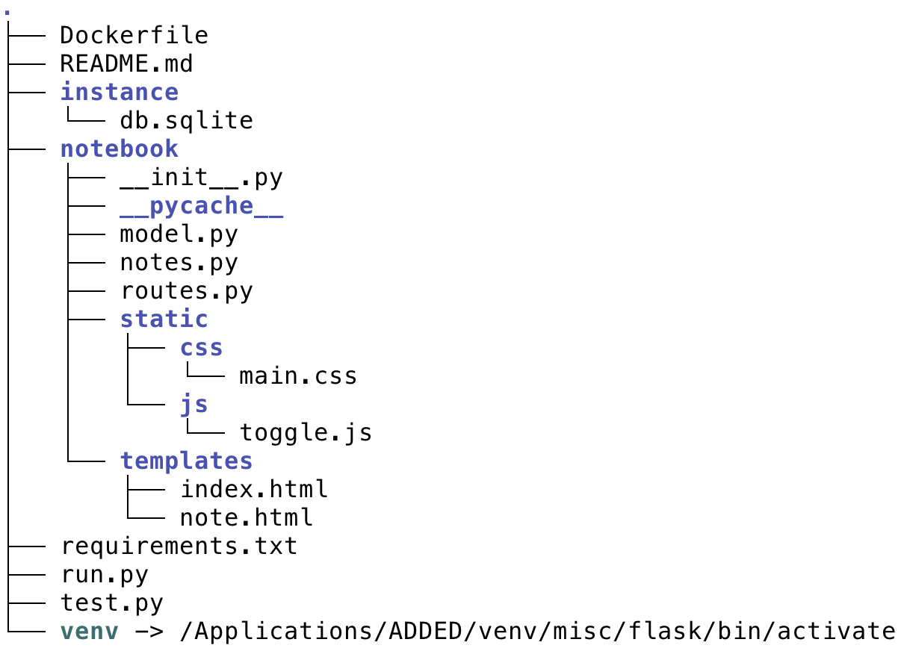

# Assignment 3

In assignment 2 you extended the note-taking application from assignment 1, adapted its Flask interface and added a database back end using Flask-SQLAlchemy. For this assignment you will create a Docker image and make sure that this image can be run in such a way that changes to the database are preserved outside the Docker container.

This assignment is simpler than what I had mentioned before, when I hinted that you may have to include the API and Streamlit applications or add unit tests. Let's not do that and take it easy here. When you get the hang of simple Dockerization then this should be fairly simple.

Due: April 4th

### New functionality for the Flask note-taking application

Nothing. The only thing needed is that your assignment 2 submission can actually change the database.

### What to deliver

In your repository you add another directory `assignment3` and you copy the contents of `assignment2` into it. You may make changes to your assignment 2 work if you wish (and probably there is at least one little change you may have to make in any case). You are also free to take the sample solution that I will post soonish and work with that one (and for that one I know that you will have to make one little change).

The only thing to add is a Dockerfile, which you should put at the top-level, that is, in the `assignment3` directory. This is what my directory structure looks like:

Yours may vary on many small points, the main requirement was that you have a notebook package. We definitely expect a usefull readme file and a requirements file. The readme file should explain how to build the image (pretty trivial) and how to run the container (less trivial).

You may do a test file, but you don't have to.

Once you are done submit and push your changes and send an email to Yifan and me. Do this by April 4th anywhere on earth.

When we run your container, we should be able to point our browser at [http://127.0.0.1:5000/](http://127.0.0.1:5000/) and see the Flask site that runs in the container.	