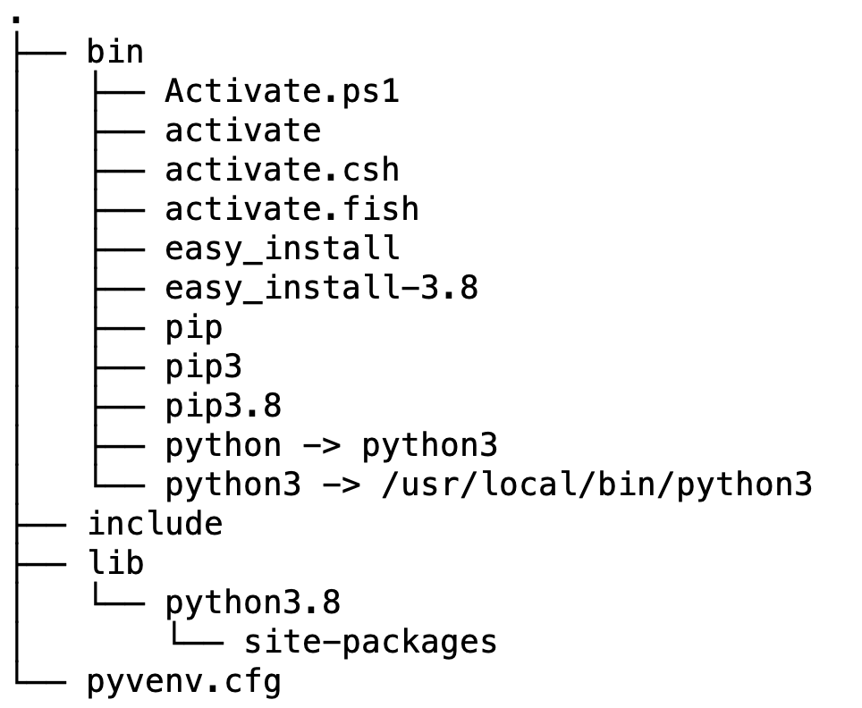

# Python Virtual Environments


### What is a virtual environment

A virtual environment is a Python tool for dependency management and project isolation. It allows Python site packages to be installed locally in an isolated directory for a particular project, as opposed to being installed globally (i.e. as part of a system-wide Python). So a virtual environment is just a self-contained directory tree with several components:

- a Python installation for a particular version of Python, using symbolic links to Python executables on your system
- a number of additional packages in a `site-packages` folder where third party libraries are installed.
- scripts that ensure executed Python code uses the Python interpreter and site packages installed inside the given virtual environment.

### Creating an environment, a look under the hood

Create an environment by running the Python `venv` module. Make sure that you use the Python version you want to use in the environment. 

```bash
$ python3 -m venv /Applications/environments/packaging
```

At this point your environment is created and the top-level looks as follows.



You can see the symbolic links, the space for the site packages, some scripts, and a configuration file. The `site-packages` has some internal structure, mostly for pip and some setup tools.

Activate the environment by sourcing the `activate` script in the environment.

```bash
$ source /Applications/environments/packaging/bin/activate
(packaging) $
```


Once you activate the environment your prompt changes. When you check where some executables live it will point to the environment and when you see what modules are installed you get a very short list.

```bash
(packaging) $ which python pip
/Applications/environments/packaging/bin/python
/Applications/environments/packaging/bin/pip
(packaging) $ pip list
pip        20.1.1
setuptools 47.1.0
(packaging) $ 
```

What did the activation do? First it changed your search path by adding the `bin` directory in the virtual environment directory to the beginning of `$PATH` so that when you type `python` or `pip` you get the right one.

```bash
$ echo $PATH
/Applications/environments/packaging/bin:/usr/local/opt/icu4c/sbin:/usr/local/opt/icu4c/bin:/Users/marc/bin:/Applications/ADDED/other/miniconda2/bin:/Users/marc/bin:/Applications/ADDED/other/apache-maven-3.3.9/bin:/usr/local/bin:/usr/bin:/bin:/usr/sbin:/sbin:/Library/TeX/texbin
```

The activation code also changed the prompt so you have a visual clue that you are in a virtual environment and it defined a command `deactivate` that you can use to pop out of the environment.

The environment includes a file `pyvenv.cfg` with some settings including the directory where the original Python executable was found and its version.

```properties
home = /usr/local/bin
include-system-site-packages = false
version = 3.8.5
```

From the environment you can still access that version and its installed modules with `/usr/local/bin/python	`. More interesting is what is going on with `include-system-site-packages`. We can see what's going on with the site packages using the built-in `site` module, which is sensitive to whether `pyvenv.cfg` is available and checks its content.

```python
>>> import site
>>> site.getsitepackages()
['/Applications/environments/packaging/lib/python3.8/site-packages']
```

This means that in the virtual environment Python will only look inside of the environment's `site-packages` directory for packages and modules. We could have created the environment with

```bash
$ python3 -m venv --system-site-packages /Applications/environments/packaging
```

In that case we would have had `include-system-site-packages = true` in the config file and the result of `getsitepackages()` would have been different.

```python
>>> site.getsitepackages()
['/Applications/environments/packaging/lib/python3.8/site-packages', '/usr/local/Cellar/python@3.8/3.8.5/Frameworks/Python.framework/Versions/3.8/lib/python3.8/site-packages']
```

Note that the `sys.path` variable is also changed in that the `site-packages` directory in the environment is added, but no directories were removed from the path.

With the environment in place you can use "pip install" and be sure that packages and modules will be installed into the environment and not mess with all kinds of other environments including your standard non-virtual one.

### Using an environment to release code

Once you have created and activated an environment for a project you just install what you need using pip. Once everything is settled use pip-freeze to save a snapshot of your package environment.

```bash
$ pip freeze > requirements.txt
```

Do NOT include the virtual environment itself in your repository, just the `requirements.txt` file. You could also document your particular sequence of pip-installs. When people get your repository all they need to do is create their own environment using the right version of Python and install all requirements.

```bash
$ pip install -r requirements.txt
```

And then they should be able to run your code without trouble.

