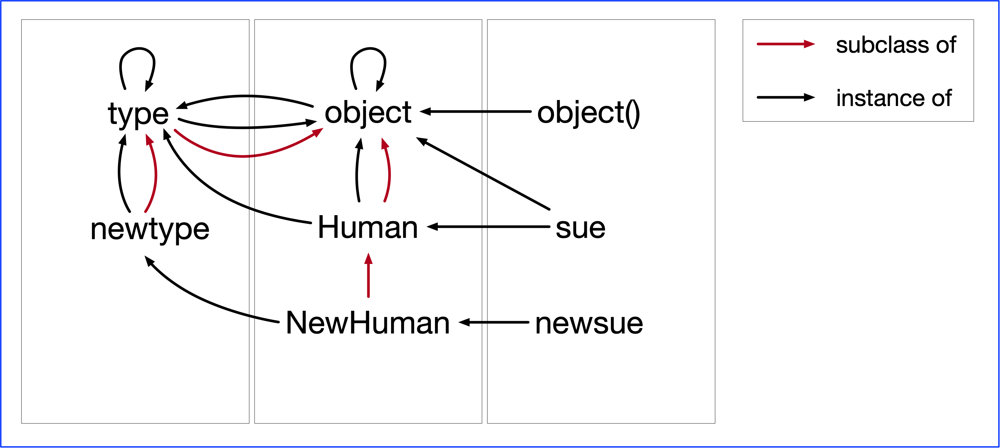

# Metaclasses

Notes on how metaclasses work and what yu can use them for.

In order to explain this we start from the beginning with explaining simple class and instance creation in a little bit more detail.

- [Creating instances](p1-instances.md)
- [Creating classes](p2-classes.md)

Sources used to compile these notes:

- [https://www.pythontutorial.net/python-oop/python-metaclass/](https://www.pythontutorial.net/python-oop/python-metaclass/)
- [https://stackoverflow.com/questions/22609272/python-typename-bases-dict](https://stackoverflow.com/questions/22609272/python-typename-bases-dict)
- [stackoverflow](https://stackoverflow.com/questions/2608708/what-is-the-difference-between-type-and-type-new-in-python)
- [Shalabh Chaturvedi - Python Types and Objects](https://web.archive.org/web/20140928161337/https://www.cs.utexas.edu/%7Ecannata/cs345/Class%20Notes/15%20Python%20Types%20and%20Objects.pdf)


Staged:

- [builtin.com](https://builtin.com/data-science/new-python) - \__new__ and \__init__
- [sentry.io](https://sentry.io/answers/super-and-init-in-python/#:~:text=__init__%20and%20achieve,dependency%20injection%20and%20multiple%20inheritance.) - super and \__init__
- [medium](https://divyakhatnar.medium.com/metaclass-in-python-bbf4a628e978#:~:text=The%20__new__()%20method%20is,classes%20are%20created%20and%20initialized.) - metaclasses


new and init:


type is both a way to get the type of an object and a way to create a class

type(someclass) is equel to sometype.__class__

type(type) ==> type




Type objects. Both the objects we introduced are type objects. So what do
we mean by type objects? Type objects share the following traits:

- They are used to represent abstract data types in programs. For instance, one (user
defined) object called User might represent all users in a system, another once called int
might represent all integers.
- They can be subclassed. This means you can create a new object that is somewhat similar
to exsiting type objects. The existing type objects become bases for the new one.
- They can be instantiated. This means you can create a new object that is an instance of the
existing type object. The existing type object becomes the `__class__` for the new object.
- The type of any type object is `<type 'type'>`.
- They are lovingly called types by some and classes by others

The term class was traditionally used to refer to a class created by the class statement. Built-in types (such as int and string) are not usually referred to as classes, but that's more of a convention thing and in reality types and classes are exactly the same thing. 

There are only two kinds of objects in Python: to be unambiguous let's call these types and non-types. Non-types could be called instances, but that term could also refer to a type, since a type is always an instance of another type. Types could also be called classes, and I do call them classes from time to time.

New objects:

- by subclassing: `class Human(object): pass`
- by instantiation: `Human('sue')`
 
d


### Understanding super


### Metaclasses

We can create a different metaclass by subclassing `type`. Here we have one that just adds one class variable to a class that is created using this metaclass:

```python
class Human(type):
    def __new__(mcs, name, bases, class_dict):
        class_ = super().__new__(mcs, name, bases, class_dict)
        class_.species = 'homo sapiens'
        return class_
```


Now we can use the new metaclass to create a Person class (using the default for the parent class):

```python
class Person(metaclass=Human):
    def __init__(self, name, age):
        self.name = name
        self.age = age
```


Let's go back to the class creation in the Human metaclass:

```python
   def __new__(mcs, name, bases, class_dict):
       class_ = super().__new__(mcs, name, bases, class_dict)
```

First note that `super().__new__` is the same function as `type.__new__`.

Also remember how with instance creation

```python
	def __init__(self, arg1 arg2): pass
```

we actually do

```python
	some_instance(arg1 arg2)
```

and similarly with

```python
   def __new__(mcs, name, bases, class_dict): pass
```

we actually do

```python
	some_class(name, bases, class_dict)
```

but in this case the class is `type`.

