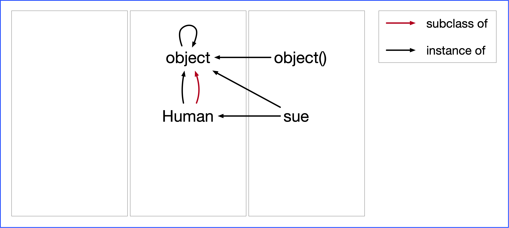

# Creating instances of classes

Instance creation is often fully automatic: when you type in a number, string or list, the object is created immediately and it is of the expected type.

```python
>>> sue = 'sue'
>>> type(sue)
<class 'str'>
```

To create an instance of a user-defined class you just call the class as if it is a regular function (really a constructor function).

```python
class Human:
	def __init__(self, name):
		self.name = name
		
sue = Human('sue')
```

The *Human* class was created as a subclass of *object* and *sue* is an instance of *Human*, as you can see in the image below.



What may be surprising is that *Human* is an instance of *object* and not just a subclass, but in Python everything is an object, even object itself. We also included *object()*, just to show an object that is not an instance of the user-defined class. 

When you create a new class instance Python will call the `__new__()` and `__init__()` methods where the first method creates an instance of the class (and returns it) and the second method initializes the new instance (while returning None). The two methods are given the same arguments, except that the first argument is the class for `__new__()` and the just created instance for `__init__()`.

It may be helpful to realize that the code `Human('sue')` is equivalent to the following:

```python
>>> obj = object.__new__(Human, 'sue')
>>> obj.__init__('sue')
>>> obj
```

The initialization method on an instance is widely used. But you don't see the instance creation method very often in the wild for regular classes, mostly because there aren't many use cases for it. One use case is if you want to limit the number of instances to a particular number and therefore sometimes want to prevent an instance from being created. You can do that as follows:

```python
class Person:

    instances = 0

    def __new__(cls, name):
        if Person.instances >= 2:
            raise Exception("Too many instances")
        Person.instances += 1
        return super().__new__(cls)

    def __init__(self, name):
        self.name = name
```

Note how `__new__()` does not take an instance as its first argument but a class. In fact, it is not an instance method but a class method, but you do not need to use the @staticmethod decorator because Python magic does that for you.

With the class definition above you will be prevented from making a third object when you try and instead of creating a Person named 'kim' you will get an exception.

```python
for name in ('sue', 'joe', 'kim'):
    person = Person(name)
    print(f"<Person {person.name}>")
```

Another use case is when you want to subclass an immutable builtin type like *float*, for example yu may want to define *Distance* as a subclass of *float* and add a unit instance variable. A simplistic way of doing this might be

```python
class Distance(float):

    def __init__(self, value, unit):
        super().__init__(value)
        self.unit = unit
```

However, doing

```python
>>> d = Distance(10, 'feet')
```

will give a TypeError because float expects only one argument.

Instead of overriding `__init__()` you should override `__new__()`:

```python
class Distance(float):

    def __new__(cls, value, unit):
        instance = super().__new__(cls, value)
        instance.unit = unit
        return instance

    def X__init__(self, value, unit):
        super().__init__(value)
        self.unit = unit
```

```python
>>> d = Distance(10.5, 'feet')
>>> print(d, d*d)
```